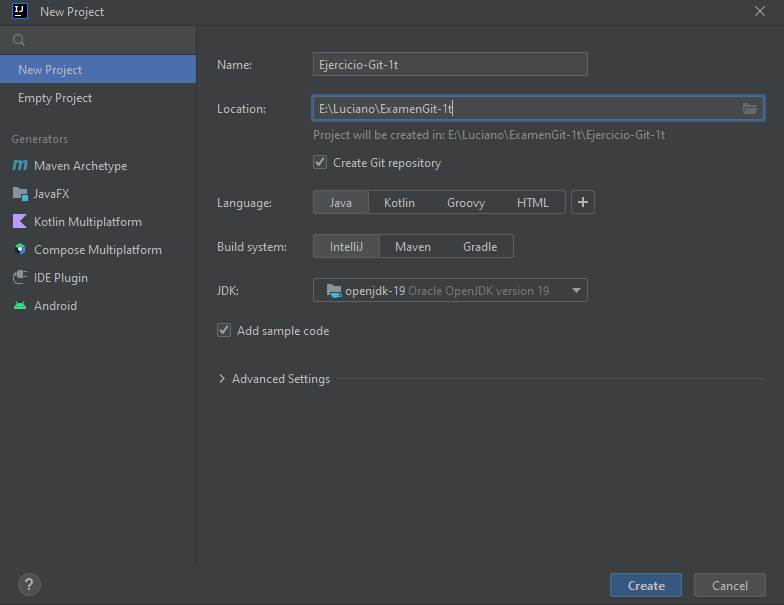
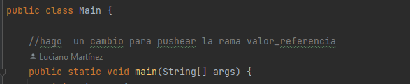
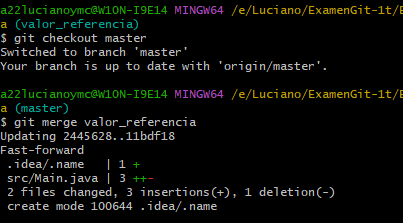
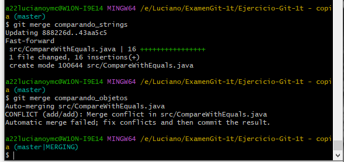

# Entornos de Desarrollo - Examen 1T

1. Creación de un proyecto de IntelliJ con repositorio Git y código de ejemplo.



2. Primer commit en master.
```bash
git commit -m "creando proyecto base"
```
3. Desarrollo la rama valor_referencia.
    Como no me dejaba conectar con el repositorio remoto hice dos commits en uno tras hacer una copia y luego hago pull request.

4. Pusheo valor_referencia


```bash
git push -u origin master
```
5. Merge a master:
```bash
git checkout master

git merge valor_referencia

```


6. Creamos una rama paso_arrays y la desarrollamos.
```bash
git checkout -b paso_arrays
```
7. Merge a master:
```bash
git checkout master

git merge paso_arrays

```
8. Creamos las ramas comparando_objetos y comparando_strings y las desarrollamos.

9. Hacemos merge de ambas a master, solventando el conflicto.



10. Creamos la rama "reestructurando" para reorganizar en paquetes. Una vez desarrollada hacemos merge a master.

11. Realizamos una corrección menor en valor_referencia y la hacemos un merge a master.

12. Añado este README.md

